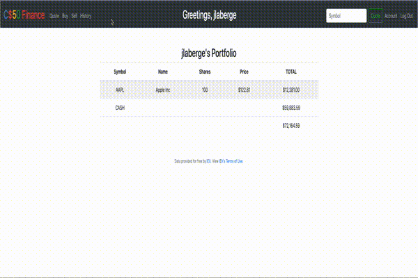
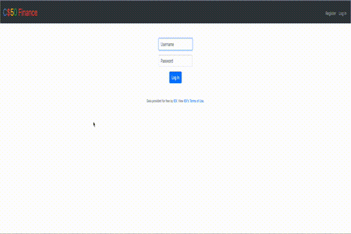

# C$50 Finance

Finance is a web application written in Python that uses Flask and Jinja templates to serve up web requests / HTML.

This application utilizes [IEX API](https://iexcloud.io/) for getting stock information. 

Here is a demo of the requirements for PSET8/Finance:

Here is a demo of some of the bonus features I've added:

- Dark Themed Navbar
- User greeting in Navbar
- Quote shortcut in the Navbar
- Account route to allow user to change password
- New passwords must conform to some base level of complexity which is implemented using a password checker function and 

## Contributing
This was completed as part of the CS50x course offered by Harvard through [edX](https://www.edx.org/course/cs50s-introduction-to-computer-science). 

So while I would appreciate any feedback, contribution is not necessary as this was part of a graded assignment.
## License
[MIT](https://choosealicense.com/licenses/mit/)
